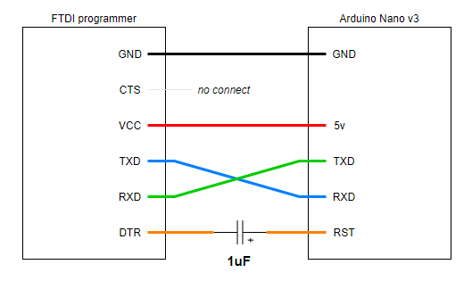

# Using FTDI programmer to upload code onto a Nano of which the USB port is broken

## Introduction

As the title of this post indicated, I will take a short note to memo how I use a FTDI programmer to upload code to a Arduino Nano via UART interface (not USB).

Why do I need to do this?

Because the USB port of my Arduino Nano was accidentally torn off from the PCB, I have to find another way to upload code to the Arduino Nano; otherwise, I will have the poor nano as my new car keyring.

## What do I need

- FTDI programmer (FTDI-USB converter)
- Arduino Nano
- Capacitor 1uF
- Some wires

## Basic idea

As Arduino officially recommends that do not occupy Arduino's TX and RX pins in your sketches if you have other choices because TX and RX will be used to build connection with your computer and upload/debug program as well. According to this information, I supposed that Arduino nano may have a USB-UART converter circuit to help with the communication between PC and nano.

Now, as the USB port has gone, is it possible to hook up a FTDI programmer to the Nano directly via UART interface? Sure!

## Wiring diagram

### Why 1μF capacitor is here?

When all source code has been compiled successfully and ready to be uploaded to the Arduino nano, the programmer will send a signal to the RST pin of the nano via its DTR pin. However, the signal sent from DTR may not perfectly trigger the reset event at the Nano side.

For example, Arduino Mega 2560 requires to apply a pulse width for *2μs* at least on the **RST** pin. **tRST** = 2μs

The capacitor here will turn a continuous analog signal sent from *DTR* into a pulse signal. As some tutorials said that a 100nF capacitor is enough; however, I tried 100nF(0.1μF) with my boards, it doesn't work.

## Conclusion

I cannot make sure 100nF or 1μF which capacitor will work fine in your case. Someone also suggest that in some cases triggering RESET manually at the Nano side could work as well, but I'm not lucky. 

